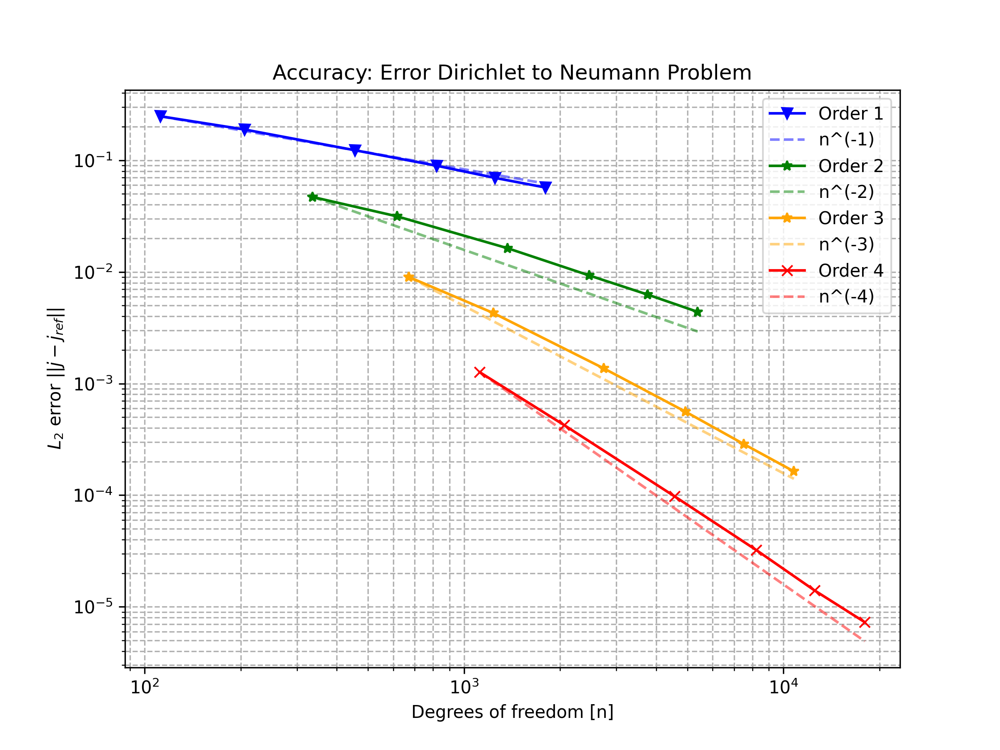
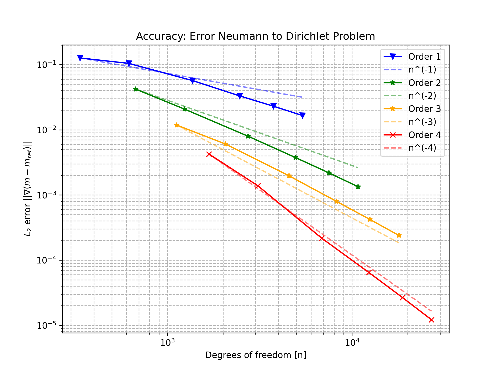
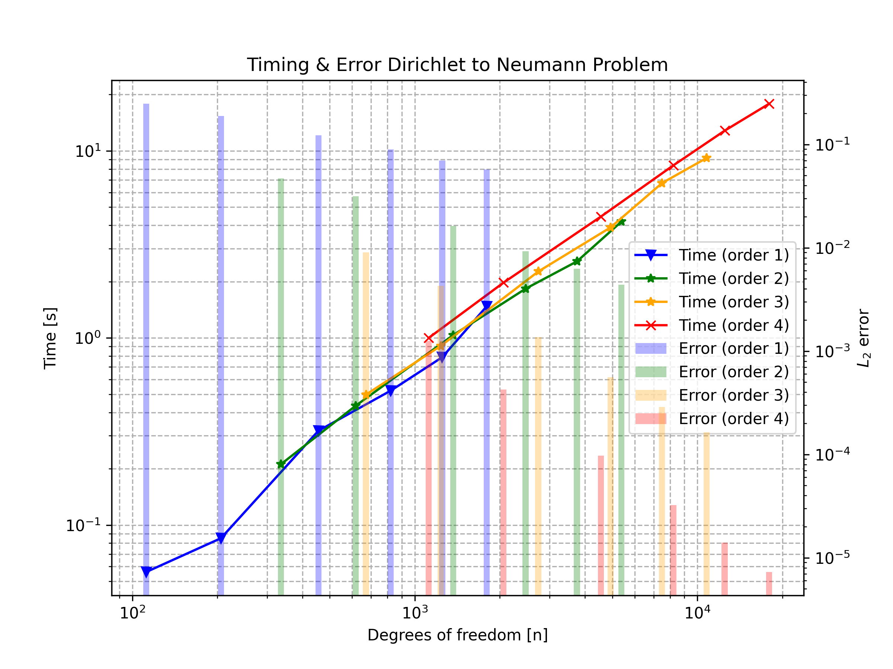
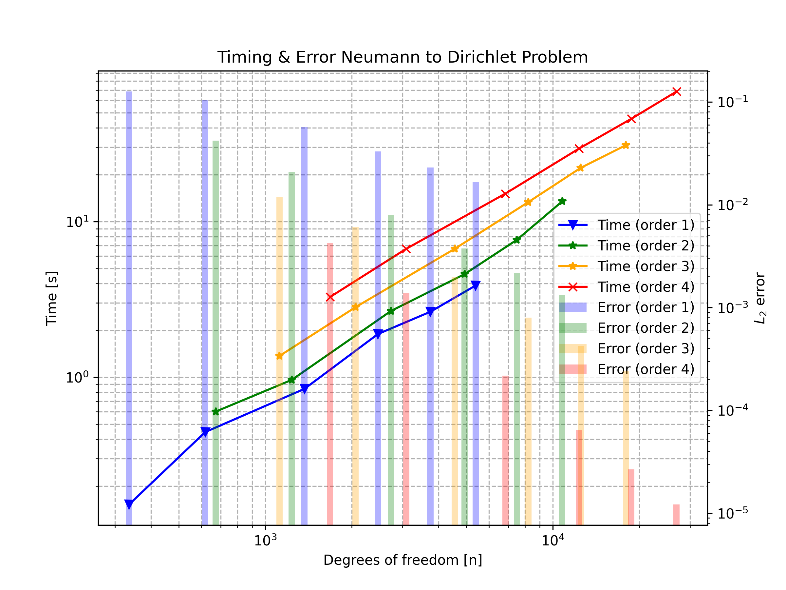
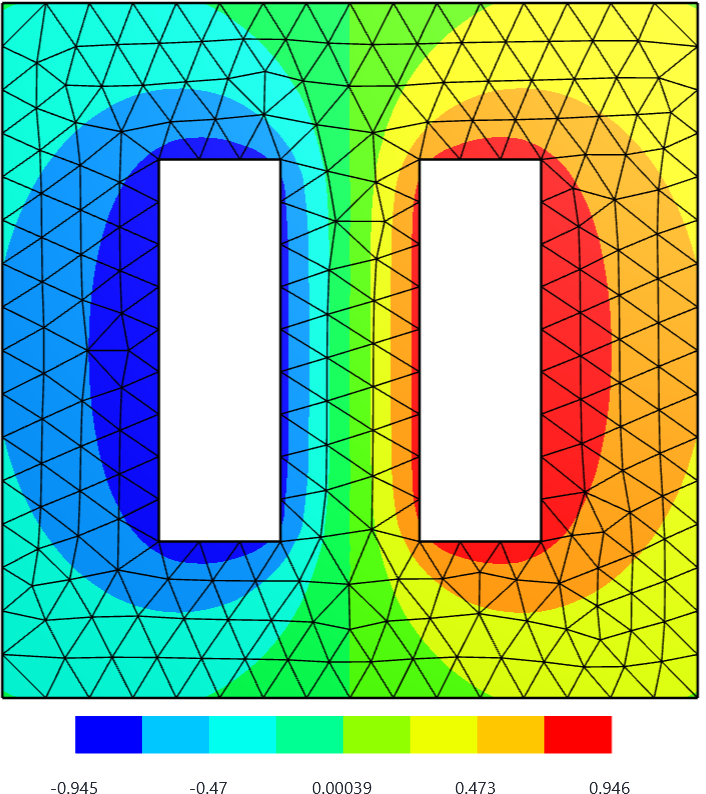
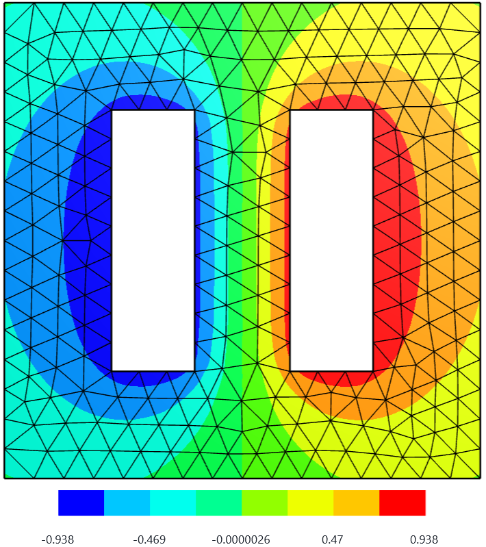

# Summary

NGSBEM is the dedicated boundary element method (BEM) module within NETGEN/NGSolve. It provides the full set of tools needed to formulate and solve boundary integral equations, including potential operators and their Galerkin discretizations. Seamlessly integrated with the NGSolve core, NGSBEM enables efficient numerical solutions of linear interior and exterior boundary value problems based on the BEM.

Key features of NGSBEM, in conjunction with NGSolve, include:

- Use of finite element spaces already available in NGSolve, including high-order elements on curved surfaces.
- A user-friendly Python interface.
- Declarative programming for problem formulation and solution.
- Standard potential operators for electrostatics, acoustics, and electromagnetics, allowing both scalar and vector-valued densities to be discretized.
- Support for multi-domain problems through FEM–BEM coupling.
- Acceleration via a Multi-Level Fast Multipole Method (MLFMM) for approximating the arising Galerkin matrices.
- Kernel-driven implementations of potential operators, enabling users to add custom operators.
- Extensive documentation and demonstrations supporting users as they start working with.

# Statement of Need

Computational engineering frequently involves solving boundary value problems (BVPs), including linear and nonlinear partial differential equations, as well as interior, exterior, and transmission problems. While the finite element method (FEM) excels at handling interior problems with nonlinearities, the BEM is the method of choice for solving linear second-order problems in unbounded domains.

A unified framework that naturally combines both approaches is rare. NETGEN/NGSolve addresses this gap by providing a complete environment for Galerkin BEM and its coupling with FEM.

# Usability, Accuracy, and Efficiency

The BEM is attractive due to its dimensional reduction and high accuracy. However, it also introduces challenges, such as singular integral operators and dense matrices. NGSBEM is designed to resolve these difficulties internally, providing robust and efficient implementations while sparing users from the underlying complexity.

## Usability

NGSolve follows the philosophy of allowing users to “type formulas as they appear in the book.” NGSBEM extends this philosophy to the BEM: users express boundary integral operators declaratively in Python, in a syntax that mirrors their mathematical formulation. This clarity and directness in representing operators is a central design goal.

Consider, for example, the Dirichlet problem

$$
\begin{cases}
\Delta \phi = 0, & \text{in } \Omega,\\
\gamma_0\phi = m, & \text{on } \Gamma.
\end{cases}
$$

The representation formula yields:

\begin{equation}\label{eq:rep_formula}
\phi(\mathbf{x}) = \mathrm{LaplaceSL}(j)(\mathbf{x})
- \mathrm{LaplaceDL}(m)(\mathbf{x})\,.
\end{equation}

To compute the unknown Neumann data $j$, one solves the Galerkin discretization of the single layer operator. With trial functions $u_j$ and test functions $v_i$, the matrix entries are

$$
V_{ij} = \int_\Gamma \left[ \mathrm{LaplaceSL}(u_j) \right] v_i \, ds.
$$

In NGSBEM, the matrix is assembled as:

```python
fesL2 = SurfaceL2(mesh, order=3, dual_mapping=True)
u, v = fesL2.TnT()
V = LaplaceSL(u * ds) * v * ds
```

Given $V$, the linear system

$$
V\, j=b
$$

is solved using a standard iterative solver.

A second example illustrates the hypersingular operator arising for the Neumann problem. Its Galerkin matrix is given by


$$
D_{ij} = \int\limits_\Gamma \left[ \mathrm{LaplaceSL}(\mathbf{curl}_\Gamma u_j) \right]  \mathbf{curl}_\Gamma v_i(\boldsymbol x) \, \mathrm{d} s_x \,.
$$

implemented simply as 

```python
D = LaplaceSL(curl(u) * ds) * curl(v) * ds
```

The linear system with Galerkin matrix $D$ is solved using a standard iterative solver.


Single and double layer operators for the Helmholtz and Maxwell equations are provided analogously.

## Accuracy

Accurate integration is central to the BEM, particularly because singular kernels must be treated with care. NGSBEM employs the specialized quadrature rules of Sauter and Schwab [@SauterSchwab:2011], which support curved elements and enable high-order convergence.

The numerical experiments below compare the computed Cauchy data with the known exact solution for the Laplace equation. The results demonstrate optimal convergence rates.


| Laplace Dirichlet Problem  | Laplace Neumann Problem  |
|:-:|:-:|
|{width=100%} | {width=100%} | 


Beyond scalar-valued problems, NGSBEM supports vector finite elements and BEM operators for electromagnetics, with numerical evidence of optimal convergence documented in [@ngsbem_docu].

Another challenge is the accurate evaluation of potentials, especially in the near field. NGSBEM implements techniques developed by Gumerov and others [@gumerov2021analyticalcomputation; @kaneko2023recursiveanalyticalquadraturelaplace]. Depending on the geometric configuration, triangles are either subdivided or a line-based approximation is applied, ensuring stable and accurate potential evaluation.

## Efficiency

Galerkin matrices are generated on the fly using the multi-level fast multipole method (MLFMM) of Greengard and Rokhlin [@GreengardRokhlin:1987], with efficient computation of translation and rotation coefficients following the work of Gumerov and Duraiswami [@gumerov2001fast; @harmonicanalysis; @Dorigo2025].

Performance is further enhanced by:

- the use of AVX vectorization,
- full parallelization across all major computational stages.

To assess efficiency, we compare accuracy and runtime across different polynomial orders. Higher-order elements provide significantly better accuracy at comparable runtime, despite the increased number of unknowns.

| Laplace Dirichlet Problem  | Laplace Neumann Problem  |
|:-:|:-:|
|{#fig:efficiency_DtN width=100%} |  {width=100%} | 

For example, in Laplace Dirichlet Problem illustrated in figure \ref{fig:efficiency_DtN}:

- order 1 at 1250 DOFs (0.789 s runtime, error 0.07), vs.,
- order 4 at 1120 DOFs (1.000 s runtime, error 0.001)

This corresponds to an error reduction of approximately 98.6% at comparable runtime.

Similar improvements appear across other configurations, demonstrating the practical efficiency of higher-order BEM.

All numerical experiments were run on a MacBook Pro equipped with an Apple M4 Pro (14 cores: 10 performance + 4 efficiency) and 48 GB
of RAM. Timings were measured on the host machine under macOS.

# Example

Solving a PDE with the BEM proceeds in two steps:

1. solve an integral equation for the unknown boundary trace(s),
2. evaluate the representation formula to obtain the solution in the domain.

Consider a plate capacitor:

|  |  |
|:-:|:-:|
| $$\begin{array}{rcl l} - \Delta \phi &=& 0, \quad &\mathrm{in} \; \Omega^c \,, \\[1ex]  \gamma_0 \phi  &=&  m\,, & \mathrm{on}\;\Gamma\,,  \\[1ex] \lim\limits_{\|x\| \to \infty} \phi(x) &=& \mathcal O\left( \displaystyle{ \frac{1}{\|x\|} }\right)\,, & \|x\|\to \infty \,. \end{array} $$  | $\quad\quad$ {width=45%}  |

Using \autoref{eq:rep_formula}, the unknown Neumann data $j$ is computed via a BEM system:

```python
j = GridFunction(fesL2)

# generate potential operators V, M and K
with TaskManager(): 
    SLPotential = LaplaceSL(u*ds(bonus_intorder=3))
    DLPotential = LaplaceDL(uH1*ds(bonus_intorder=3))
    V = SLPotential*v*ds(bonus_intorder=3)
    K = DLPotential*v*ds(bonus_intorder=3)
    M = BilinearForm(uH1*v*ds(bonus_intorder=3)).Assemble()

# solve the linear system V j = (-1/2 M + K) m
with TaskManager():
    pre = BilinearForm(u.Trace()*v.Trace()*ds, diagonal=True).Assemble().mat.Inverse()
    rhs = ((-0.5 * M.mat + K.mat) * m).Evaluate()
    CG(
      mat = V.mat, pre=pre, rhs = rhs, sol=j.vec, tol=1e-8, maxsteps=200,
      initialize=False, printrates=False
      )
```

Afterwards, the potential $\phi$ can be evaluated anywhere. For example, on a screen cutting through the plates:

```python
screen = WorkPlane(
  Axes((0,0,0), X, Z)).RectangleC(4, 4).Face() 
  - Box((-1.1,-1.1,0.4), (1.1,1.1,1.1)) 
  - Box((-1.1,-1.1,-1.1), (1.1,1.1,-0.4)
  )
mesh_screen = Mesh(OCCGeometry(screen).GenerateMesh(maxh=0.25)).Curve(1)
fes_screen = H1(mesh_screen, order=3)
phi_on_screen = GridFunction(fes_screen)
print ("ndofscreen=", fes_screen.ndof)
with TaskManager():
    phi_on_screen.Set(
      -SLPotential(j)+DLPotential(utop)+DLPotential(ubot),
      definedon=mesh_screen.Boundaries(".*"), dual=False
      )
Draw (gf_screen)
```

The BEM solution (left) and a FEM reference solution (right) are shown here:


|   |   |  
|:-:|:-:|
|{width=100%}  |{width=100%}| 

Because the problem is exterior, the FEM requires either infinite elements or an artificial boundary with prescribed data. The BEM, in contrast, handles the unbounded domain naturally and without mesh refinement at edges or corners. The maximum discrepancy between FEM and BEM is around 2.5%, occurring near corner singularities.

Further examples, including FEM–BEM coupling, mixed formulations, and acoustic or electromagnetic scattering, can be found in the online documentation [@ngsbem_docu].

Details on the theoretical background for high order BEM for electrostatics and electromagnetics, can be found in [@Weggler:2011; @Weggler:2012]. 

# References

